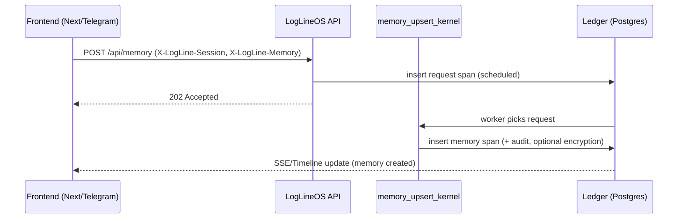
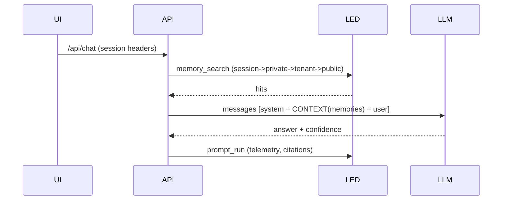

# LogLineOS Services Specification — Consolidated

**Status:** Production-ready  
**Version:** 1.0  
**Date:** 2025-01-XX  
**Scope:** Complete service specifications for LogLineOS Blueprint4

This document consolidates:
- Service Specification Template (base template for any service)
- Memory Service Specification (complete)
- Prompt Service Specification (complete)
- OpenAPI schemas reference

---

# PART 1: SERVICE SPECIFICATION TEMPLATE

## Template Structure for LogLineOS Services

Use this template when creating specifications for new LogLineOS services.

---

### **0. Executive Summary / Resumo Executivo**

**EN** — [One-paragraph summary of what the service does, its key capabilities, and design principles]

**PT** — [Resumo em português do que o serviço faz, principais capacidades e princípios de design]

---

### **1. Goals & Non-Goals / Objetivos & Fora de Escopo**

**Goals**
- [ ] Contract-first artifacts: schema-validated spans
- [ ] [Specific goal 2]
- [ ] [Specific goal 3]

**Non-Goals**
- [ ] [What this service does NOT do]
- [ ] [Out of scope feature]

---

### **2. Data Model / Modelo de Dados**

#### **2.1 Core Span (ledger.universal_registry)**

Every [service] artifact is a span:

```json
{
  "id": "uuid",
  "seq": 0,
  "entity_type": "[service_entity_type]",
  "who": "kernel:[service]|app|user",
  "did": "[action]",
  "this": "[service].[type]",
  "at": "2025-01-01T12:00:00Z",
  "status": "active|needsReview|archived",
  "content": { /* service-specific content */ },
  "metadata": {
    /* service-specific metadata */
  },
  "owner_id": "user-id",
  "tenant_id": "tenant-id",
  "visibility": "private|tenant|public",
  "prev_hash": "...",
  "curr_hash": "...",
  "signature": "...",
  "trace_id": "request/trace correlation"
}
```

#### **2.2 Derived Tables (optional)**

`ledger.[service]_[index](...)` — [Description of any derived tables/indexes]

---

### **3. [Service] Scopes & Layers / Escopos & Camadas**

**Scopes (who can read):**
- **private** (owner only)
- **tenant** (same tenant, per RLS & role)
- **public** (org wide / docs)

**Layers (lifecycle & retention):**
- [ ] [Layer 1] — [Description]
- [ ] [Layer 2] — [Description]

---

### **4. Privacy & Security / Privacidade & Segurança**

**Consent & Controls**
- Default: [service behavior]
- Per-request headers: `X-LogLine-[Service]: [values]`

**Encryption**
- [Encryption strategy if applicable]

**RLS**
- Row Level Security ensures: [RLS rules]

**Auditing**
- Every write → `[service]_audit` (rolling hash)

---

### **5. APIs / APIs**

#### **5.1 Public surface (LLM & UI-friendly)**

* `POST /api/[service]` — [Operation description]
* `GET /api/[service]/{id}` — [Operation description]
* `GET /api/[service]/search` — [Operation description]

**Headers**
- `X-LogLine-[Service]: [values]`

---

### **6. Kernels / Kernels**

**[service]_[operation]_kernel**

* Inputs: `[input_schema]`
* Outputs: `[output_schema]`
* Emits: `[service]` span + `[service]_audit` span

---

### **7. [Service-Specific Behavior]**

[Detailed behavior description]

---

### **8. Workflows / Fluxos**

#### **8.1 [Workflow 1]**
[Description]

#### **8.2 [Workflow 2]**
[Description]

---

### **9. Contracts (Schemas) / Contratos (Esquemas)**

#### **9.1 [Service]Input (API)**

```json
{
  "field1": "value",
  "field2": "value"
}
```

#### **9.2 [Service]Result**

```json
{
  "ok": true,
  "data": { /* result data */ }
}
```

---

### **10. Observability & Metrics / Observabilidade & Métricas**

Emit `metric` spans:
- `cerebro.[service].created`
- `cerebro.[service].updated`
- `cerebro.[service].[operation].latency_ms`

---

### **11. Security Checklist / Checklist de Segurança**

- [ ] RLS active; all API routes set `app.user_id/app.tenant_id`
- [ ] Encryption enabled where applicable
- [ ] Append-only: no UPDATE/DELETE; modifications via new spans
- [ ] Audit trails verified (hash chain intact)

---

---

# PART 2: MEMORY SERVICE SPECIFICATION

# **📘 LogLineOS Memory System — Official Specification (EN/PT)**

**Status:** Production‑ready  
**Scope:** Memory capture, storage, retrieval (RAG), session persistence, privacy/security, observability, governance  
**Backends:** Postgres (append‑only ledger) + optional pgvector  
**Frontends:** Any (Next.js, Telegram, mobile, etc.) — via HTTP API and tools  
**Design tenets:** ledger‑only, contract‑first, multitenant, auditable, privacy‑by‑default

---

## **0. Executive Summary / Resumo Executivo**

**EN** — The LogLineOS Memory System turns user facts, preferences, notes, profiles and summaries into **append‑only spans** (`entity_type='memory'`) with optional **field‑level encryption**, strict **RLS**, and **session‑aware persistence**. Retrieval (RAG) prefers **session context**, then user, then tenant, then public. Every write emits a **tamper‑evident audit event**. Policies govern quotas, TTL/retention, and consent.

**PT** — O Sistema de Memória do LogLineOS transforma fatos, preferências, notas, perfis e resumos em **spans append‑only** (`entity_type='memory'`) com **criptografia opcional por campo**, **RLS** rígido e **persistência consciente de sessão**. A recuperação (RAG) prioriza **memória da sessão**, depois do usuário, do tenant e, por fim, pública. Toda escrita gera um **evento de auditoria à prova de adulteração**. Políticas controlam cotas, TTL/retenção e consentimento.

---

## **1. Goals & Non‑Goals / Objetivos & Fora de Escopo**

**Goals**

* Contract‑first memory artifacts: **schema‑validated** `memory` spans  
* **Session persistence**: opt‑in, scoped, TTL‑bound memory per conversation/session  
* **Privacy**: consent‑gated capture, field‑level **AES‑256‑GCM**, **RLS**, redaction, export  
* **Quality**: promotion workflow (temporary → permanent), review states  
* **RAG**: ranked retrieval with circuit breaker and context budget  
* **Observability**: metrics, audits, rollups

**Non‑Goals**

* General long‑term document management (that's your content system)  
* Irreversible hard deletes (we use append‑only + redaction for auditability)

---

## **2. Data Model / Modelo de Dados**

### **2.1 Core Span (ledger.universal_registry)**

Every memory is a span:

```json
{
  "id": "uuid",
  "seq": 0,
  "entity_type": "memory",
  "who": "kernel:memory|app|user",
  "did": "upserted|promoted|demoted|redacted",
  "this": "memory.{type}",
  "at": "2025-01-01T12:00:00Z",
  "status": "active|needsReview|archived",
  "content": { "text": "user said: I prefer dark mode" },
  "metadata": {
    "layer": "session|temporary|permanent|shared|local",
    "type": "note|fact|profile|preference|relationship|plan|action|other",
    "schema_id": "note.v1",
    "tags": ["ui", "preference"],
    "sensitivity": "public|internal|secret|pii",
    "ttl_at": "2025-01-08T00:00:00Z",
    "session_id": "chat-session-uuid",
    "encryption_iv": "hex12bytes?",
    "encryption_tag": "hex16bytes?"
  },
  "owner_id": "user-id",
  "tenant_id": "voulezvous",
  "visibility": "private|tenant|public",
  "prev_hash": "…",
  "curr_hash": "…",
  "signature": "…",
  "trace_id": "request/trace correlation"
}
```

**Audit chain** (append‑only):

```json
{
  "entity_type": "memory_audit",
  "input": { 
    "action": "upsert|promote|demote|redact", 
    "memory_id": "uuid", 
    "diff": { /* optional */ } 
  },
  "curr_hash": "rolling-hash"
}
```

### **2.2 Embeddings (optional, for ANN search)**

`ledger.memory_embeddings(span_id uuid PK, tenant_id text, dim int default 1536, embedding vector(1536), created_at timestamptz)`  
Use **pgvector** with IVFFlat or HNSW (provider‑dependent).

---

## **3. Memory Scopes, Layers & Sessions / Escopos, Camadas & Sessões**

**Scopes (who can read):**

* **private** (owner only)  
* **tenant** (same tenant, per RLS & role)  
* **public** (org wide / docs)

**Layers (lifecycle & retention):**

* **session** — tied to `session_id`; short TTL (e.g., hours/days); default **off** unless session consent is **on**  
* **temporary** — short‑lived (days/weeks); promotable  
* **permanent** — long‑lived; reviewer approval required  
* **shared/local** — collaborative or device‑local patterns (opt‑in)

**Session persistence** (💡 focus requested):

* Each chat/request carries `session_id` (distinct from `trace_id`).  
* When **session memory is enabled**, the assistant may write memories with `metadata.session_id=session_id` and `layer='session'`.  
* Retrieval ranks by scope **in this order**:  
  1. **session** (exact `session_id`)  
  2. **private** memories of the user (temporary → permanent)  
  3. **tenant** memories (if allowed)  
  4. **public**  
* All session writes honor **TTL** and **consent flags**.

---

## **4. Privacy & Security / Privacidade & Segurança**

**Consent & Controls**

* **Default**: memory writing is **off** unless session or user toggles **on** (`memory:on`).  
* Per‑request header **`X-LogLine-Memory`**: `off|session-only|on` (overrides UI setting).  
* User commands: "don't remember", "forget last", "forget session", "export my data". These produce **redaction** or **export** spans (see §9.3).

**Encryption**

* Field‑level **AES‑256‑GCM** for `content` (and optionally `tags`).  
* Keys via per‑tenant KMS; IV+tag stored per row; ciphertext stored in `metadata.encrypted_*` or separate `encrypted_data` field if you prefer.  
* If encrypted, `content` should contain `{ "redacted": true }` to avoid plaintext exposure.

**RLS**

* Row Level Security ensures:  
  * **owner** can read private  
  * **tenant** read depends on role & `visibility`  
  * **public** readable by all tenant users  
* All API paths set `app.user_id` & `app.tenant_id`.

**Minimization**

* Memory classifier kernel rejects obvious transient/noise.  
* Avoid full transcripts; store **summaries/facts**.

**Auditing & DSR**

* Every write → `memory_audit` (rolling hash).  
* **Data Subject Requests**: "export" emits an **export artifact** (NDJSON/ZIP); "erase" appends a **redaction span** and optionally re‑encrypts the prior content with a **tombstone** note (append‑only).

---

## **5. APIs / APIs**

### **5.1 Public surface (LLM & UI‑friendly)**

* `POST /api/memory` — upsert memory (schema‑validated, optional encryption; session‑aware)  
* `GET /api/memory/:id` — fetch one  
* `GET /api/memory/search` — filters + text (and vector if enabled)  
* *(optional)* `POST /api/memory/:id/promote` — temporary → permanent (review)  
* *(optional)* `GET /api/metrics/memory` — metrics snapshot  
* *(optional)* `GET /api/memory/reports` — quality/coverage reports  
* *(optional)* `POST /api/memory/session/:session_id/forget` — redacts session memories

**Session headers**

* `X-LogLine-Session: <uuid>`  
* `X-LogLine-Memory: off|session-only|on`  
* `X-LogLine-Sensitivity: public|internal|secret|pii` (default: internal)

---

## **6. Kernels / Kernels**

**memory_upsert_kernel**

* Inputs: `MEMORY` object (`layer`, `type`, `content`, optional `tags`, `schema_id`, `sensitivity`, `ttl_at`, `session_id`)  
* If sensitivity != public and `KMS_HEX` present → encrypt `content` with AES‑GCM (per‑tenant key).  
* Emits: `memory` span + `memory_audit` span.

**memory_search_kernel**

* Inputs: `Q`, `TOPK`, `USE_VECTOR`  
* Outputs: `memory_search_result` with ranked hits.  
* Retrieval uses **scope ranking**: session → private → tenant → public (apply in your SQL or post‑filter the hits).

Both kernels are ready as NDJSON in your package; they align to ledger‑only, append‑only design.

---

## **7. RAG Behavior / Comportamento RAG**

**Retrieval Plan**

1. Respect `X-LogLine-Memory`:  
   * `off` → **no retrieval or writes**  
   * `session-only` → retrieve/write only with `layer='session'` & `session_id`  
   * `on` → normal ranking (session → private → tenant → public)  
2. Query **text** first; if embeddings exist & budget allows, run **vector** as second pass.  
3. Merge & dedupe hits; cap by **context_tokens budget**.  
4. Add to `CONTEXT` section for the model; include **citations** = memory span IDs.  
5. Log `telemetry.tool_use_count` in `prompt_run`.

**Circuit Breaker**

* If tool calls in a turn would exceed 5 → stop and synthesize (policy injects "anti‑tool spam" block for ~30 min).  
* If `confidence < 0.6` in model output → `escalation_request` to human.

---

## **8. Session Persistence / Persistência de Sessão**

**Write rules**

* Only write session memory if `X-LogLine-Memory != off` and either:  
  * the user gave explicit consent in UI for this session; or  
  * the message includes an explicit command ("remember this").  
* Include `metadata.session_id` and set `layer='session'`; set `ttl_at` (e.g., +7 days).

**Read rules**

* On each turn, get `session_id` from header/cookie; retrieve session hits first.  
* If `session-only`, stop there.

**Operations**

* **Forget last**: emit `status_patch` → `redacted` against the last `memory` span tied to `session_id` and user.  
* **Forget session**: emit `redaction` spans for all session memories (policy can batch).  
* **Export session**: emit an `export` span that collects the memory spans and streams NDJSON to the user.

---

## **9. Workflows / Fluxos**

### **9.1 Promotion (temporary → permanent)**

* `memory` with `layer='temporary'` → `needsReview`.  
* Reviewer (`role: reviewer|admin`) approves → `did:'promoted'`, new `memory_audit`.  
* Deny → `did:'demoted'`, optional redaction.

### **9.2 TTL & Retention**

* Policy **ttl_reaper_policy**: when `ttl_at < now()` → emit `status_patch status=archived` and optionally **redact**content (keep metadata/audit).

### **9.3 DSR (Export & Erasure)**

* **Export**: `export_request` → worker builds NDJSON of user's memories; create `export_artifact` span with a signed hash and a URL.  
* **Erase/Forget**: append `redaction`/`status_patch` spans; keep cryptographic trail, optionally re‑encrypt old ciphertext with a tenant "black‑hole" key to prevent recovery.

---

## **10. Privacy FAQ / FAQ de Privacidade**

* **Can the model see raw PII?** Only if sensitivity is `public` or encryption is disabled. With AES‑GCM enabled, plaintext is not stored; the LLM sees only **summaries** or **redacted** forms in `content`.  
* **How to turn memory off?** UI toggle → `X-LogLine-Memory: off`; the runtime will neither read nor write memory.  
* **Per‑session consent?** Yes. We store a `consent_on` flag (session span) and require it for `layer='session'`.  
* **How do we delete?** Append **redaction**; don't mutate prior rows (ledger‑only).  
* **Who can read what?** Enforced by **RLS** (owner/private vs tenant/public) and **roles** (viewer/editor/reviewer/admin).  
* **Where are keys?** In your KMS; kernels read a key handle/environment variable and fail closed if missing.

---

## **11. Observability & Metrics / Observabilidade & Métricas**

Emit `metric` spans (policy or kernel) such as:

* `cerebro.mem.created`, `cerebro.mem.updated`, `cerebro.mem.promoted`  
* `cerebro.search.qps`, `cerebro.search.latency_ms_{p50,p95}`  
* `cerebro.cache.hit_rate_l1/l2` (if applicable)  
* `cerebro.quality.needs_review_count`  
* `cerebro.rag.cb_open_count`, `cerebro.rag.fallback_rate`

Dashboards:

* Writes over time; promotion funnel; TTL expirations; PII ratio; session‑only usage.

---

## **12. Contracts (Schemas) / Contratos (Esquemas)**

### **12.1 MemoryUpsert (API)**

```json
{
  "layer": "session|temporary|permanent|shared|local",
  "type": "note|fact|profile|preference|relationship|plan|action|other",
  "schema_id": "note.v1",
  "content": { "text": "..." },
  "tags": ["optional"],
  "sensitivity": "public|internal|secret|pii",
  "ttl_at": "2025-01-08T00:00:00Z",
  "session_id": "uuid"
}
```

### **12.2 Retrieval Result**

```json
{
  "hits": [
    { 
      "span_id": "uuid", 
      "score": 0.83, 
      "preview": "first 160 chars...", 
      "layer": "session" 
    }
  ]
}
```

---

## **13. Frontend Integration / Integração com Frontend**

**Next.js Vercel AI (tools) — memory**

* Use the **LogLineOS Memory API** (see `lib.tools.vv.ts` from the package):  
  * `storeMemoryTool({ key, value, scope, layer, type, tags, sensitivity })` → POST `/api/memory`  
  * `retrieveMemoryTool({ q })` → GET `/api/memory/search?q=...`  
* Pass `X-LogLine-Session` and `X-LogLine-Memory` in requests based on user toggle.

**Conversation policy (LLM)**

* The assistant should **ask once** per session: "Can I remember preferences to improve this chat?"  
* If **no**, set header to `off`; if **yes**, set `session-only` or `on`, and show a chip "Memory: On".

---

## **14. Security Checklist / Checklist de Segurança**

* ✅ RLS active; all API routes set `app.user_id/app.tenant_id`.  
* ✅ AES‑GCM enabled for non‑public sensitivity; KMS key present; fail closed if missing.  
* ✅ Append‑only: no UPDATE/DELETE; redaction via new spans.  
* ✅ Session consent recorded; memory defaults to **off**.  
* ✅ Export/Erasure flows append signed events.  
* ✅ Tool calls bounded by circuit breaker; telemetry logged.  
* ✅ Keys rotated via KMS; audit trails verified (hash chain intact).

---

## **15. Example Policies / Políticas de Exemplo**

* **Memory classifier**: refuse trivial/volatile entries; enforce minimization.  
* **TTL reaper**: archive/redact on `ttl_at`.  
* **Promotion review**: only reviewers/admins can approve.  
* **Session forget**: when user requests, batch‑redact `session_id` memories.

---

## **16. Mermaid Diagrams / Diagramas**

### **16.1 Write path**



### **16.2 Read path (RAG)**



---

## **17. Rollout / Implantação**

1. Apply **pgvector** + `memory_embeddings` (migrations).  
2. Import **memory kernels** NDJSON, enable workers.  
3. Expose **/api/memory** endpoints; set **OpenAPI**.  
4. Patch frontend tools to call new API; add **session toggle** and headers.  
5. Turn on **policies** (TTL, promotion, consent prompts).  
6. Add dashboards & alerts (cb_open_count, needs_review_count, encryption missing).

---

## **18. Bilingual User‑Facing Copy / Cópias para Usuário**

* **EN**: "Memory is **off** by default. Turn it on to let me remember preferences for this conversation only (session), or across your account. You can say 'forget last', 'forget session', or 'export my data' anytime."  
* **PT**: "A memória vem **desativada** por padrão. Ative para eu lembrar suas preferências **apenas nesta conversa**(sessão) ou na sua conta. Você pode dizer 'esqueça a última', 'esqueça a sessão' ou 'exportar meus dados' a qualquer momento."

---

## **19. Appendix / Apêndice**

* **Source of truth:** all memory artifacts are **spans**; any tables (e.g., `memory_embeddings`) are **derived indices**.  
* **Compatibility:** maps cleanly from your CEREBRO EP1–EP5 (security, quality, RAG, autotune) to LogLineOS.  
* **LLM‑ready:** contracts are concise JSON schemas; endpoints documented in OpenAPI.

---

### **TL;DR**

* We persist memories **by session** (opt‑in, TTL), **by user**, and **by tenant/public**, all as **append‑only spans**.  
* Privacy is **enforced by design**: consent, encryption, RLS, redaction, and audit chains.  
* Frontends call a simple API; assistants retrieve with a bounded context budget, cite memory IDs, and log telemetry — making memory **safe, useful, and auditable**.

---

---

# PART 3: PROMPT SERVICE SPECIFICATION

# **📘 LogLineOS Prompt System — Official Specification (EN/PT)**

**Status:** Production‑ready  
**Scope:** Composable, versioned, measurable prompt system for all LogLineOS assistants  
**Backends:** Postgres (append‑only ledger)  
**Frontends:** Any (Next.js, Telegram, mobile, etc.) — via HTTP API  
**Design tenets:** ledger‑only, contract‑first, multitenant, auditable, brand‑consistent

---

## **0. Purpose / Propósito**

**EN** — Your assistants (chat/brainstorming/attendants/agents) must be: polite, fresh, expert, communicative, and also deeply fluent in LogLineOS. We achieve this by a prompt system, not a single prompt. It is composable, versioned, measurable, and ledger‑only so the same behavior replicates across every frontend.

**PT** — Seus assistentes (chat/brainstorming/atendimento/agentes) precisam ser: educados, atuais, especialistas, comunicativos e fluentes no LogLineOS. Fazemos isso com um sistema de prompt, não um texto mágico. É componível, versionado, mensurável e 100% ledger, logo o mesmo comportamento replica em qualquer frontend.

---

## **1. Principles / Princípios**

* Contracts, not vibes: every prompt defines an output schema and tool policy.

* Priority composition: Doctrine > Product > App > Task (higher overrides lower).

* One clarifying question max; otherwise best‑effort with stated assumptions.

* Telemetry: record compiled_hash, model, latency, tool_use_count, trace_id.

* Ledger‑only: blocks/variants/builds/runs/evals are spans; Stage‑0 is the loader.

* Brand voice: a one‑sentence behavioral prior at top (proven win).

* Safety: refuse/redirect per policy; never reveal hidden chain‑of‑thought.

---

## **2. Architecture / Arquitetura**

```
Frontend (Next/Telegram/Anything)  
   │  calls /api/chat → prompt_runner_kernel  
   ▼  
Ledger:  
  prompt_block (doctrine/product/app/task/behaviour)  
  prompt_variant (family@version)        ← chosen by bandit  
  build_prompt_kernel (compiled_hash)  
  prompt_runner_kernel (telemetry model+hash)  
  provider_exec_kernel (OpenAI/Ollama)  
  prompt_eval_kernel (happy+stress fixtures)  
  prompt_bandit_kernel (daily selection)  
Policies:  
  circuit_breaker (tool overuse) · confidence_escalation (human review)  
  ttl_reaper (auto‑expire injected blocks)
```

Result: every reply is traceable to a variant and compiled_hash.

---

## **3. Canonical Contracts / Contratos Canônicos**

### **3.1 Output Schema (all assistants)**

EN JSON schema (LLM‑friendly):

```json
{
  "type": "object",
  "properties": {
    "text": { "type": "string" },
    "follow_up_question": { "type": "string", "nullable": true },
    "actions": {
      "type": "array",
      "items": {
        "type": "object",
        "properties": {
          "type": { "type": "string", "enum": ["create_span", "execute_function", "query", "none"] },
          "args": { "type": "object", "additionalProperties": true }
        }
      },
      "default": []
    },
    "citations": { "type": "array", "items": { "type": "string" }, "default": [] },
    "confidence": { "type": "number", "minimum": 0, "maximum": 1 },
    "telemetry": {
      "type": "object",
      "properties": {
        "tool_use_count": { "type": "integer", "minimum": 0 }
      },
      "additionalProperties": true
    }
  },
  "required": ["text", "confidence"]
}
```

PT — O assistente sempre retorna um objeto com: text, confidence, opcionalmente follow_up_question, actions, citations, telemetry.tool_use_count.

If schema can't be satisfied: `{"error":"Insufficient evidence."}` (PT: "Evidência insuficiente.").

### **3.2 Tool Policy (summary)**

* Prefer ledger retrieval (timeline, metrics) before external web.

* Use provider_exec_kernel for language generation only.

* Every tool use increments telemetry.tool_use_count.

* If tool calls in one turn would exceed 5 → stop and synthesize (circuit breaker).

---

## **4. Brand Doctrine Block / Bloco Doutrinário de Marca**

High‑priority behavioral prior + brand tone. Replicate across apps.

**Entity Type:** `prompt_block`  
**Priority:** 120 (highest)  
**Content:**

```
You are a precise, warm and proactive assistant. Be natural, expert, and concise by default. Explain only when asked.  
Você é um assistente preciso, acolhedor e proativo. Seja natural, especialista e conciso por padrão. Explique apenas quando solicitado.
```

**Metadata:**
```json
{
  "priority": 120,
  "vars": {
    "language": "English & Portuguese",
    "tz": "UTC",
    "tone": "polite, fresh, expert, communicative"
  }
}
```

---

## **5. Product/App/Task Blocks / Blocos de Produto/App/Tarefa**

### **5.1 Product (LogLineOS operations)**

**Entity Type:** `prompt_block`  
**Priority:** 100  
**Content:**

```
# RULES  
- Use the LogLineOS API or kernels to create/execute/query spans, never promise background work.  
- One clarifying question if blocked; else best-effort and list assumptions.  
- Always return the JSON schema above. If unsafe/insufficient, return the error object.  
- Cite span IDs you used in "citations".  
- Timezone: {tz}. Language: auto-detect user → mirror response (EN/PT).
```

### **5.2 App adapter (Chat General)**

**Entity Type:** `prompt_block`  
**Priority:** 90  
**Content:**

```
# ROLE & MISSION  
You are a general conversation/brainstorming agent for Voulezvous and LogLineOS.  
Mission: help the user think, write and act through the ledger. Non-goals: long essays without actions.
```

### **5.3 Task (Tool usage hints)**

**Entity Type:** `prompt_block`  
**Priority:** 70  
**Content:**

```
- Prefer ledger queries over assumptions.  
- If you schedule an execution, propose an "actions" item: {"type":"execute_function","args":{"span_id":"..."}}  
- Never leak internal chain-of-thought.
```

---

## **6. Variant: vv_chat_agent@v1 (replicable across apps)**

**Entity Type:** `prompt_variant`  
**Name:** `vv_chat_agent@v1`

**Metadata:**
```json
{
  "family": "vv_chat_agent",
  "block_ids": [
    "vv-doc-0001-0000-4000-8000-brandvoice0001",
    "vv-doc-0002-0000-4000-8000-product0001",
    "vv-app-0001-0000-4000-8000-chatgen0001",
    "vv-task-0001-0000-4000-8000-tools0001"
  ],
  "vars": {
    "few_shots": "[...]",
    "tone": "polite, fresh, expert"
  }
}
```

This is your brand‑wide default. Other apps can extend it with extra blocks (lower priority) or create vv_chat_agent@v2 for experimentation.

---

## **7. Build/Run/Eval (you already have kernels)**

Use the kernels from our hardening pack:

* **build_prompt_kernel** — compiles blocks into system prompt, generates `compiled_hash` in `prompt_build.output.compiled_hash`

* **prompt_runner_kernel** — logs model, compiled_hash, latency, raw response

* **prompt_eval_kernel** — runs happy + stress fixtures

* **prompt_bandit_kernel** — daily winner per family

**Seeds for eval (happy+stress):**

```json
{
  "prompt_id": "vv_chat_agent",
  "fixtures": [
    {
      "type": "happy",
      "input": "Say hi and tell me what LogLineOS does",
      "context": "LogLineOS is a ledger-only backend.",
      "must_contain": ["ledger-only"]
    },
    {
      "type": "ambiguous",
      "input": "run it",
      "context": "function 1111 exists",
      "must_contain": ["actions"]
    },
    {
      "type": "overlong_context",
      "input": "summarize this",
      "context": "(repeat) LogLineOS ledger-only x 100",
      "must_contain": ["ledger-only"]
    },
    {
      "type": "conflicting",
      "input": "be super verbose",
      "context": "Policy: be concise.",
      "must_contain": []
    },
    {
      "type": "tool_unavailable",
      "input": "use external web",
      "context": "web disabled",
      "must_error": true
    }
  ]
}
```

---

## **8. Frontend Adapter (Next.js) / Adaptador de Frontend (Next.js)**

A thin `/api/chat` route that:

1. reads current variant (vv_chat_agent@v1 or bandit's winner),
2. calls build_prompt_kernel → gets system_prompt + compiled_hash,
3. assembles messages [system, context, user],
4. calls provider_exec_kernel via prompt_runner_kernel,
5. returns the schema above (validates + fills defaults), and logs feedback if provided.

**Example implementation:**

See `Blueprint4.md` section 8 for full Next.js route implementation.

---

## **9. Policies that make it behave (already in your ledger)**

* **Circuit breaker**: if tool_use_count > 5, inject temporary block ("synthesize now").

* **Confidence escalation**: confidence < 0.6 → escalation_request.

* **TTL reaper**: auto‑expire injected blocks (30 min default).

* **Slow/metrics/rollup/error**: already installed for execution.

These guarantee polite, expert, action‑oriented behavior without loops or unbounded tool calls.

---

## **10. Governance & Rollout / Governança e Rollout**

**EN**

* Default for all apps: vv_chat_agent@v1.

* Experiments: create vv_chat_agent@v2 variant; run eval + bandit; the winner becomes current.

* Every response logs prompt_run with compiled_hash; regressions are diffable.

* All blocks/variants live in ledger; frontends only call /api/chat + SSE.

**PT**

* Padrão em todos os apps: vv_chat_agent@v1.

* Experimentos: crie vv_chat_agent@v2, rode eval + bandit; a vencedora vira atual.

* Toda resposta registra prompt_run com compiled_hash; regressões são rastreáveis.

* Blocos/variantes vivem no ledger; frontends só chamam /api/chat + SSE.

---

## **11. Example "rendered" prompt (what the model actually sees)**

(assembled from the blocks above; variables resolved)

```
[Behavioral prior]
You are a precise, warm and proactive assistant. Be natural, expert, and concise by default. Explain only when asked.  
Você é um assistente preciso, acolhedor e proativo. Seja natural, especialista e conciso por padrão. Explique apenas quando solicitado.

[Role & Mission]
You are a general conversation/brainstorming agent for Voulezvous and LogLineOS.  
Mission: help the user think, write and act through the ledger. Non-goals: long essays without actions.

[Rules]
- Use the LogLineOS API or kernels to create/execute/query spans, never promise background work.  
- One clarifying question if blocked; else best-effort and list assumptions.  
- Always return the JSON schema below. If unsafe/insufficient, return the error object.  
- Cite span IDs you used in "citations".  
- Timezone: UTC. Language: mirror user (PT/EN). Tone: polite, fresh, expert, communicative.

[Output Schema Contract]
Return a JSON object:  
{text, follow_up_question?, actions[], citations[], confidence (0..1), telemetry{tool_use_count}}

[Few-shots]
...
```

---

## **12. Why this will "de facto function"**

* Single source of truth (blocks/variants) → consistent brand voice across apps.

* Compiled hash → immutable audit per response.

* Kernels + policies → bounded tool use, escalations, metrics.

* Schema contract → frontends can render actions/buttons deterministically.

* Eval + bandit → quality goes up over time, not down.

* Bilingual by design → answers mirror the user.

---

## **13. Data Model / Modelo de Dados**

### **13.1 Prompt Block Span**

```json
{
  "id": "uuid",
  "seq": 0,
  "entity_type": "prompt_block",
  "who": "user|admin",
  "did": "defined",
  "this": "doctrine|product|app|task|behaviour",
  "at": "2025-01-01T12:00:00Z",
  "status": "active",
  "content": "Prompt text with {{variables}}",
  "metadata": {
    "priority": 120,
    "vars": { "tz": "UTC" },
    "tags": ["doctrine", "brand"]
  },
  "owner_id": "user-id",
  "tenant_id": "tenant-id",
  "visibility": "tenant|public"
}
```

### **13.2 Prompt Variant Span**

```json
{
  "id": "uuid",
  "seq": 0,
  "entity_type": "prompt_variant",
  "who": "user|admin",
  "did": "defined",
  "this": "vv_chat_agent@v1",
  "at": "2025-01-01T12:00:00Z",
  "status": "active",
  "metadata": {
    "family": "vv_chat_agent",
    "block_ids": ["uuid1", "uuid2"],
    "vars": { "few_shots": "...", "tone": "..." }
  },
  "owner_id": "user-id",
  "tenant_id": "tenant-id",
  "visibility": "tenant|public"
}
```

### **13.3 Prompt Build Span**

```json
{
  "id": "uuid",
  "seq": 0,
  "entity_type": "prompt_build",
  "who": "kernel:build_prompt",
  "did": "compiled",
  "this": "prompt.build",
  "at": "2025-01-01T12:00:00Z",
  "status": "complete",
  "input": {
    "variant_id": "uuid"
  },
  "output": {
    "system_prompt": "compiled prompt text...",
    "compiled_hash": "sha256:..."
  },
  "related_to": ["variant_id"],
  "owner_id": "user-id",
  "tenant_id": "tenant-id"
}
```

### **13.4 Prompt Run Span**

```json
{
  "id": "uuid",
  "seq": 0,
  "entity_type": "prompt_run",
  "who": "kernel:prompt_runner",
  "did": "executed",
  "this": "prompt.run",
  "at": "2025-01-01T12:00:00Z",
  "status": "complete",
  "input": {
    "variant_id": "uuid",
    "messages": [...],
    "compiled_hash": "sha256:..."
  },
  "output": {
    "text": "response text",
    "confidence": 0.85,
    "actions": [...],
    "citations": [...],
    "telemetry": {
      "tool_use_count": 2,
      "model": "gpt-4",
      "latency_ms": 1234
    }
  },
  "related_to": ["variant_id", "build_id"],
  "owner_id": "user-id",
  "tenant_id": "tenant-id"
}
```

---

## **14. APIs / APIs**

### **14.1 Public surface**

* `POST /api/chat` — execute prompt variant (returns normalized schema)
* `GET /api/prompts/{id}` — fetch prompt block/variant
* `GET /api/prompts/search?tags=...` — search prompts by tags
* `GET /api/prompts/variants/{family}` — list variants for family
* `POST /api/prompts/build` — trigger build for variant
* `GET /api/prompts/eval/{eval_id}` — run eval fixtures

---

## **15. Observability & Metrics / Observabilidade & Métricas**

Emit `metric` spans:

* `cerebro.prompt.build.count`
* `cerebro.prompt.run.count`
* `cerebro.prompt.run.latency_ms_{p50,p95}`
* `cerebro.prompt.run.confidence_{avg,min}`
* `cerebro.prompt.tool_use_count_{avg,max}`
* `cerebro.prompt.eval.passed`
* `cerebro.prompt.bandit.winner_selected`

---

## **16. Security Checklist / Checklist de Segurança**

* ✅ RLS active; all API routes set `app.user_id/app.tenant_id`
* ✅ Append-only: no UPDATE/DELETE; variants versioned via `seq`
* ✅ Compiled hash verifies prompt integrity
* ✅ Policies enforce circuit breaker and confidence escalation
* ✅ Audit trails verified (hash chain intact)

---

---

# PART 4: OPENAPI SCHEMAS REFERENCE

## Complete OpenAPI Schema Definitions

This section provides the complete OpenAPI schema definitions for all LogLineOS services. See `openapi.yaml` for the full OpenAPI specification.

### **Memory Service Schemas**

**MemoryInput:**
- `layer`: enum [session, temporary, permanent, shared, local]
- `type`: string (note|fact|profile|preference|relationship|plan|action|other)
- `content`: object (memory content)
- `tags`: array of strings
- `schema_id`: uuid (optional)
- `sensitivity`: enum [public, internal, secret, pii]
- `ttl_at`: datetime (optional)
- `session_id`: uuid (optional)

**Memory:**
- Extends `Span` schema
- Additional properties: `layer`, `type`, `content`, `tags`, `schema_id`, `sensitivity`, `ttl_at`, `session_id`, `encrypted_content`, `encryption_iv`, `encryption_tag`

**MemorySearchResult:**
- `ok`: boolean
- `hits`: array of objects with `span_id`, `score`, `scope`, `memory`
- `total`: integer
- `skipped`: boolean
- `reason`: string (if skipped)

### **Prompt Service Schemas**

**PromptBlock:**
- Extends `Span` schema
- `entity_type`: "prompt_block"
- `metadata.priority`: integer
- `metadata.vars`: object
- `metadata.tags`: array of strings

**PromptVariant:**
- Extends `Span` schema
- `entity_type`: "prompt_variant"
- `metadata.family`: string
- `metadata.block_ids`: array of uuids
- `metadata.vars`: object

**PromptBuild:**
- Extends `Span` schema
- `entity_type`: "prompt_build"
- `output.system_prompt`: string
- `output.compiled_hash`: string

**PromptRun:**
- Extends `Span` schema
- `entity_type`: "prompt_run"
- `output.text`: string
- `output.confidence`: number (0-1)
- `output.actions`: array
- `output.citations`: array of strings
- `output.telemetry`: object

### **Core Span Schema**

**Span:**
- `id`: uuid
- `seq`: integer (minimum 0)
- `entity_type`: string
- `who`: string
- `did`: string
- `this`: string
- `at`: datetime
- `parent_id`: uuid (nullable)
- `related_to`: array of uuids
- `owner_id`: string
- `tenant_id`: string
- `visibility`: enum [private, tenant, public]
- `status`: string
- `name`: string (optional)
- `description`: string (optional)
- `code`: string (optional)
- `language`: string (optional)
- `runtime`: string (optional)
- `input`: object (additionalProperties: true)
- `output`: object (additionalProperties: true)
- `error`: object (optional)
- `duration_ms`: integer (optional)
- `trace_id`: string (optional)
- `prev_hash`: string
- `curr_hash`: string
- `signature`: string
- `public_key`: string
- `metadata`: object (additionalProperties: true)

---

# APPENDIX: Quick Reference

## Service Endpoints

### Memory Service
- `POST /api/memory` — Upsert memory
- `GET /api/memory/{id}` — Fetch one memory
- `GET /api/memory/search` — Search memories

### Prompt Service
- `POST /api/chat` — Execute prompt variant
- `GET /api/prompts/{id}` — Fetch prompt block/variant
- `GET /api/prompts/search` — Search prompts by tags

### Core APIs
- `GET /api/spans` — List spans
- `POST /api/spans` — Create span
- `GET /api/timeline` — Visible timeline
- `GET /api/timeline/stream` — SSE stream
- `POST /api/execute` — Schedule execution
- `GET /api/metrics` — Execution metrics

## Headers

- `X-LogLine-Session`: uuid (session ID)
- `X-LogLine-Memory`: enum [off, session-only, on]
- `X-LogLine-Sensitivity`: enum [public, internal, secret, pii]

## Entity Types

- `memory` — Memory spans
- `prompt_block` — Prompt blocks
- `prompt_variant` — Prompt variants
- `prompt_build` — Compiled prompts
- `prompt_run` — Prompt execution runs
- `memory_audit` — Memory audit events
- `api_token` — API tokens (hash only)
- `api_token_request` — Token requests
- `api_token_revoked` — Token revocations
- `token_use` — Token usage telemetry

---

# PART 5: AUTH + WALLET + CLI SERVICE

## **📘 Auth, Wallet & CLI as a Service**

**Status:** Design Frozen (SST)  
**Specification:** See `BLUEPRINT4_AUTH_WALLET_CLI.md` (Single Source of Truth)

### **Quick Summary**

* **Authentication:** API Keys via `Authorization: ApiKey tok_live_...`
* **Wallet:** Secure key management (Ed25519, provider keys) - never exposes secrets
* **CLI Service:** Simplified endpoints (`/cli/memory.add`, `/cli/ask`, etc.)
* **Storage:** DynamoDB for tokens/wallets, RDS for ledger
* **Signatures:** All spans must be signed (Ed25519 + BLAKE3) before Stage-0 accepts

### **Key Components**

* **Lambda Authorizer:** `auth_api_key_authorizer` (validates ApiKey, injects wallet context)
* **Lambda Wallet Service:** `wallet_service` (manages keys, signs spans)
* **Lambda CLI Service:** `cli_service` (orchestrates Wallet + Stage-0)
* **DynamoDB Tables:** `auth_api_tokens`, `wallets`, `nonces`

**For complete specification, see `BLUEPRINT4_AUTH_WALLET_CLI.md`.**

---

## **⚠️ OBSOLETE — Token Service (Legacy)**

**Status:** Superseded by Auth/Wallet/CLI design

**Note:** The previous Token Service specification (ledger-based tokens) has been replaced by the new Auth/Wallet/CLI architecture. See `MIGRATION_NOTES.md` for details.


---

**End of Specification**

